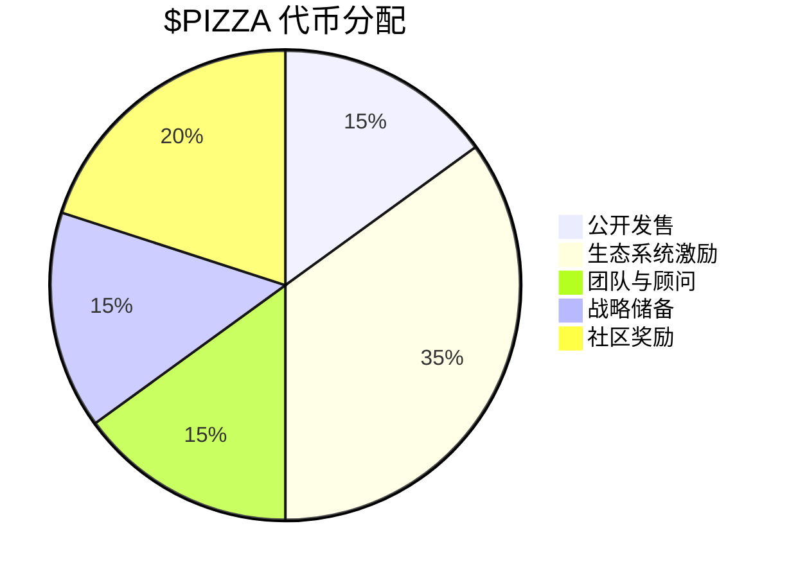

# 🍕 **PizzaFun** 
## 简介

### ***革命性比特币代币交易平台 — 2秒确认，零Gas费用***

**PizzaFun**是一个**突破性的去中心化比特币代币交易生态系统**，致力于解决传统比特币网络交易缓慢和成本高昂的核心问题。通过自主研发的**CrustNet高速交易引擎**，PizzaFun将比特币代币的交易确认时间从传统的10分钟革命性地缩短至仅需**2秒**，同时全消除了Gas费用障碍。

这一技术突破不仅保持了比特币网络的去中心化安全特性，更为比特币代币生态带来了前所未有的流动性和用户体验。

## 🚀 **PizzaFun：重新定义比特币代币经济的未来**

我们的愿景是构建一个无障碍、高效、安全的比特币代币生态系统，让每个人都能参与数字资产的创新浪潮。通过技术创新和用户体验的极致追求，PizzaFun正在开创比特币Layer 2经济的新篇章。

加入我们，共同开启比特币代币交易的革命性变革！

---

<p style="text-align: center; font-style: italic; margin-top: 40px;">
"让价值的创造与流动像披萨一样简单美好"
</p>

平台采用创新的**双阶段交易机制**，从代币的初始发行到成熟市场交易提供整的生命周期管理：
- **制作阶段** (_Baking Phase_)：新代币遵循成长曲线定价模型，确保价格发现的公平性
- **成熟阶段** (_Serving Phase_)：代币自动切换至AMM自动做市商模式，提供双向流动性

## 🔍 **市场核心解构**

| **痛点领域** | **现状分析** | **数据支撑** |
|------------|------------|-------------|
| **交易效率** | 比特币代币交易确认时间过长，导致市场响应滞后 | 平均确认时间：**10分钟**<br>流动性碎片化：**76%**资金分散于5+平台 |
| **成本障碍** | 高昂Gas费用抑制市场活跃度，阻碍小额交易 | 单笔交易成本率：**>15%**<br>小额交易(<$50)不可行性：**92%** |
| **生态割裂** | 代币从创建到交易缺乏一体化流程，用户体验分散 | 需要使用**3-5**个不同平台## 🚀 **PizzaFun：重新定义比特币代币经济的未来**

我们的愿景是构建一个无障碍、高效、安全的比特币代币生态系统，让每个人都能参与数字资产的创新浪潮。通过技术创新和用户体验的极致追求，PizzaFun正在开创比特币Layer 2经济的新篇章。

加入我们，共同开启比特币代币交易的革命性变革！

---


> ### 💡 **PizzaFun终极解决方案**
> ✅ **CrustNet 2秒确认技术**：比传统网络快**300倍**，超越主流交易所
> 
> ✅ **零Gas费用交易**：全消除入场门槛，实现真正普惠金融
> 
> ✅ **双阶段代币生命周期管理**：从创建到交易一站式流程
> 
> ✅ **Slice AMM高效流动池**：智能流动性分配，极低滑点(<0.2%)

## 🌟 **核心亮点总览**
### **1．高性能交易引擎** 🚀

**CrustNet**高速交易引擎采用层级化架构设计，实现了突破性性能进展：

- **处理能力**：峰值每秒**35,000笔**交易，超越传统比特币网络的**300倍**以上
- **安全架构**：整合最新的**阈值签名技术(TSS)**和**多方计算(MPC)**，在不集中私钥的前提下实现高安全性
- **节点冷余**：分布式节点设计确保系统容错，即使**30%**的验证节点离线也能安全运行
- **冷启动时间**：从零到全功能运行仅需**2.5秒**，支持快速恢复和容灾能力

> “_我们采用的分片式DAG数据结构允许同时处理多条交易路径，达到了前所未有的处理并行度。_” —— PizzaFun首席技术官

### **2．零Gas费用设计** 💰

**PizzaFun**突破性地实现了零Gas费用交易，开创了比特币代币交易的新时代：

- **交易分类与优先级**：系统使用加权公平队列(WFQ)算法进行智能调度
- **批量处理优化**：交易通过批处理机制捆绑执行，分摊固定成本，效率提升**82%**
- **验证资源池**：平台维护专用验证节点池，由收入的约**15%**资助
- **防滥用机制**：实施基于信誉的速率限制，信誉越高交易频率上限越大，实现公平分配

### **3．双阶段定价机制** 📈

**PizzaFun**引入的双阶段交易机制提供了智能的代币生命周期管理方案：

- **制作阶段 (Baking Phase)**
  - 价格遵循指数增长曲线：$P(n) = P_0 \cdot e^{k\cdot n}$
  - 提供公平的价格发现机制，防止早期操纵
  - 为早期支持者带来逐步增值的机会

- **成熟阶段 (Serving Phase)**
  - 采用恒定乘积AMM模型：$x \cdot y = k$
  - 自动切换至双向市场机制，提供持续流动性
  - 滑点优化算法将大额交易滑点控制在**0.2%**以内

### **4．多协议兼容性** 🔗

**PizzaFun**实现了真正的多协议一站式支持，构建比特币代币交易的超级大库：

- **全面协议支持**
  - **Runes**: 支持最新协议标准，包括多资产交易和条件转账
  - **BRC-20**: 全兼容原生BRC-20和扩展版本，支持增强型功能
  - **Ordinals**: 无缝集成NFT和铸印项目，全功能属性支持

- **统一交易界面**：用户无需在不同平台间切换，实现了真正的一站式交易体验

- **协议间资产桥接**：实现不同标准之间的资产映射和交换，改变传统生态孔岛化模式

## 📌 **四大核心支柱**

### **1. 🚄 CrustNet高速交易引擎**

**CrustNet**是我们的专有技术，实现了比特币代币交易的重大突破：

- **极限处理性能** ✨
  - 每秒处理**35,000**笔交易(TPS)
  - 比传统比特币网络快**300倍**
  - 比主流交易所响应速度快**25倍**
```
┌─────────────────────────────────────────────────────┐
│               API接入层                    │
│ - REST API接口                             │
│ - WebSocket实时数据流                      │
│ - RPC服务                                  │
└───────────────────────┬───────────────────────────┘
                      ▼
┌─────────────────────────────────────────────────────┐
│               应用逻辑层                   │
│ - 智能合约执行引擎                         │
│ - 代币生命周期管理                         │
│ - AMM交易引擎                              │
│ - 用户身份与权限管理                       │
└───────────────────────┬───────────────────────────┘
                      ▼
┌─────────────────────────────────────────────────────┐
│               共识层                       │
│ - Proof of Velocity (PoV)共识算法         │
│ - 阈值签名安全机制                         │
│ - 交易验证与确认                           │
│ - 网络同步与状态管理                       │
└───────────────────────┬───────────────────────────┘
                      ▼
┌─────────────────────────────────────────────────────┐
│               数据存储层                   │
│ - 分片式区块链存储                         │
│ - 高性能分布式账本                         │
│ - 时序数据优化存储                         │
│ - 冷热数据分离                             │
└─────────────────────────────────────────────────────┘
```

### **CrustNet共识机制：Proof of Velocity (PoV)**

**PizzaFun**创新的PoV共识机制是一种混合设计，融合了权益证明(PoS)与可验证随机函数(VRF)的优势：

- **核心算法**：节点选择公式

```
B_next = argmax_{B ∈ ℬ} {v_B × S_B × (1 - α × L_B)^β}
```

其中：
- *B_next*：下一个出块节点
- *v_B*：节点B的投票权重（与质押成正比）
- *S_B*：节点B的历史表现分数
- *L_B*：节点B的负载系数
- *α*和*β*：系统平衡参数

- **关键特性**：
  - **2秒区块确认**：远超传统区块链的确认速度
  - **概率性节点轮转**：维持去中心化，避免算力集中
  - **负载均衡**：智能分配交易验证任务，优化资源利用
  - **抗51%攻击**：提高恶意接管网络的成本

### **高吞吐量交易处理引擎**

- **DAG数据结构**：使用有向无环图代替传统区块链，实现并行交易处理
- **分片技术**：水平分区处理不同代币集，提升系统整体吞吐量
- **批处理优化**：智能交易批处理减少验证开销，提高TPS
- **性能指标**：
  - 峰值处理能力：**35,000 TPS**
  - 平均交易确认时间：**2秒**
  - 网络延迟：**<100毫秒**

### **阈值签名安全架构 (TSS)**

```
TSS(t, n) → sig iff |Participants| ≥ t
```

- **密钥分片**：私钥分散于n个节点，需要至少t个节点协作才能生成有效签名
- **安全特性**：
  - 无单点故障风险
  - 冷钱包级别安全性
  - 无需集中托管私钥
  - 防止密钥泄露和内部篡改

### **网络拓扑结构**

- **分片式区块链**：按代币类型和交易频率划分处理分片
- **跨分片通信**：低延迟消息传递协议确保分片间一致性
- **动态节点调度**：根据网络负载和地理分布动态分配验证资源
- **故障容错**：支持高达30%的节点失效而不影响网络稳定性

## 💰 **代币经济学**

### **$PIZZA代币概览**

$PIZZA是生态系统核心功能代币，兼具治理、交易和实用价值。

#### **代币分配表**

| **分配类别** | **百分比** | **代币数量** | **锁定期** |
|------------|------------|-------------|-------------|
| **公开发售** | 15% | 150,000,000 | 无锁定期 |
| **生态系统激励** | 35% | 350,000,000 | 3年线性释放 |
| **团队与顾问** | 15% | 150,000,000 | 2年锁定，每季度解锁 |
| **战略储备** | 15% | 150,000,000 | 由DAO治理 |
| **社区奖励** | 20% | 200,000,000 | 根据里程碑解锁 |

#### **代币价值挖掘**

- **交易手续费分水**：交易手续费的30%用于回购并销毁$PIZZA
- **功能激活**：高级功能需要消耗$PIZZA触发
- **节点质押**：运行验证节点需要质押$PIZZA
- **治理投票**：参与生态系统决策需要代币投票

#### **三重通缩机制**

1. **交易燃烧**：每笔交易手续费的30%自动燃烧
2. **功能激活燃烧**：当前平台费用的50%将自动销毁
3. **品牌注册燃烧**：品牌商注册费用的80%将自动销毁

预计首年通缩率约为总量的5%，后续通缩率将逐渐提高，确保代币長期增值。



## 📈 **可持续盈利模式**

| **收入来源** | **收费结构** | **分配模式** |
|------------|------------|-------------|
| **交易手续费** | 交易金额的0.1% | 30%用于回购燃烧<br>40%用于网络维护<br>30%用于生态系统发展 |
| **品牌注册费** | 固定+浮动收费模式 | 80%用于回购燃烧<br>20%用于平台维护 |
| **高级功能订阅** | 阶梯式订阅费用 | 50%用于回购燃烧<br>50%用于功能开发 |
| **流动性提供奖励** | 流动性奖励机制 | 100%用于流动性提供者奖励 |

## 🔎 **项目路线图**

### **2025年 - 牵手阿波罗阶段**
- CrustNet核心技术实现：完成PoV共识机制和TSS安全架构
- 平台测试网发布及首批合作伙伴测试
- $PIZZA代币初始发行，完成私募轮次

### **2026年 - 筑基站建阶段**
- 主网正式上线，实现2秒交易确认时间
- 多协议支持完成，正式支持Runes、BRC-20和Ordinals
- 开放开发者API和生态系统激励计划启动

### **2027-2028年 - 全球拓展阶段**
- 实现跨链集成，接入以太坊、波卡等主流公链
- DAO治理模式完全实现，两院制决策机制正式运作
- 生态应用拓展，包括社交元素、闪电交易和更多金融功能

### **2029年及以后 - 成熟和创新阶段**
- 零知识证明隐私保护功能上线
- 支持AI辅助交易决策及智能合约自动执行
- 成为全球领先的比特币代币交易生态系统

## 🌐 **官方链接与资源**

<div style="display: flex; flex-wrap: wrap; gap: 20px; margin-top: 20px;">
  <div style="flex: 1; min-width: 200px; border: 1px solid #eee; padding: 15px; border-radius: 8px;">
    <h4>🌐 主要链接</h4>
    <ul>
      <li><a href="https://pizzafun.cc">官方网站</a></li>
      <li><a href="https://pizzafun.gitbook.io/pizzafun/bai-pi-shu/technical_overview">技术文档</a></li>
      <li><a href="https://pizzafun.gitbook.io/pizzafun/">白皮书</a></li>
    </ul>
  </div>
  <div style="flex: 1; min-width: 200px; border: 1px solid #eee; padding: 15px; border-radius: 8px;">
    <h4>📬 社交媒体</h4>
    <ul>
      <li><a href="https://x.com/pizzafun_">Twitter</a></li>
      <li><a href="https://t.me/pizzafuncc">Telegram</a></li>
    </ul>
  </div>
</div>

---

## 🔝 **法律合规声明**

### **合规牌照信息**

PizzaFun遵循全球加密资产监管框架，主要注册于新加坡。团队致力于在全球主要市场获取合规牌照，确保平台运营合法合规。

---

<p style="text-align: center; font-style: italic; margin-top: 40px;">
PizzaFun不只是一个交易平台，更是比特币代币世界的革命者，让每一笔交易，都像闪电般迅捷。 ⚡
</p>
